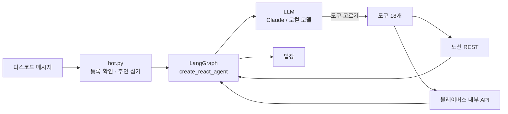

# 🎀 공주비서 (Princess Secretary)

> 말만 하면 노션과 블레이버스를 대신 채워주는 디스코드 집사봇


노션을 켜고, 오늘 행을 찾고, 체크박스를 누르고, 회고 칸에 글을 적는다. 하루 2분. 그런데 그 2분이 귀찮아서 사흘치가 밀린다.

디스코드에 **"오늘 운동 다녀왔어"** 한 줄이면 끝나게 만들었다.

---

## 1. 이렇게 씁니다

```
나: 오늘 운동 다녀왔고 영어 스피킹 30분 했어
봇: 야레야레, 오늘도 부지런하셨군요 아가씨.
    운동 체크하고, 영어 스피킹 칸에 30분 기록해 두었어요.

나: 오전 작업 시작해줘
봇: 블레이버스 '오전' 태스크 시간기록을 시작했어요.

나: 오늘 회고에 뭐라고 썼지?
봇: '오늘 한 일'에 이렇게 적으셨어요 — ...
```

<!-- 스크린샷 2~3장 자리 -->

---

## 2. 어떻게 동작하나



봇 프로세스는 **하나**다. 사람마다 코드를 띄우는 게 아니라, 한 대에 각자 자격증명을 등록해서 나눠 쓴다.

## 3. 파일 구조

```
.
├── run.py                     진입점 (asyncio.run)
├── requirements.txt
├── .env.example               설정 견본
│
├── secretary/
│   ├── config.py              env·토큰·경로·KST 를 한 곳에서
│   ├── persona.py             '아가씨' 집사 시스템 프롬프트
│   ├── context.py             "지금 이 요청은 누구 것인가" (contextvars)
│   ├── users.py               사용자 저장소 (SQLite + Fernet 암호화)
│   ├── onboarding.py          등록 시 검증 · 노션 DB 탐색
│   ├── commands.py            슬래시 커맨드 5개
│   ├── agent.py               LangGraph 조립 · 프롬프트 · 모델 선택 · 캐시
│   ├── bot.py                 디스코드 게이트웨이 · 메시지 처리 · 기동
│   ├── alarms.py              정해진 시각 알림 (LLM 안 부름)
│   ├── webserver.py           /health (봇과 같은 이벤트루프)
│   ├── notion_tools.py        데일리루틴 도구 5개
│   ├── homework_tools.py      과제 제출 도구 4개
│   └── blaybus_tools.py       블레이버스 도구 9개
│
├── scripts/                   검증 · 관측용 (읽기 전용)
├── notebooks/                 vLLM 실험 노트북
└── Dockerfile · docker-compose.yml
```

---

## 4. 할 수 있는 것

| 갈래 | 도구 | 하는 일 |
|---|---|---|
| 노션 데일리루틴 | 5개 | 조회 · 읽기 · 체크 · 쓰기 · 사진 인증 |
| 노션 과제 제출 | 4개 | 주차별 행 조회 · 생성 · 기록 |
| 블레이버스 | 9개 | 시간기록 시작/중지, 아젠다 · 워크 · 태스크 조회와 생성 |

그 밖에 정해진 시각 알림(출근 · 퇴근 · 주간 브리핑)과 슬래시 커맨드 5개.

## 5. 못 하는 것

- **블레이버스는 특정 회사의 사내 서비스다.** 계정이 없으면 그 9개는 못 쓴다 (나머지는 정상 동작)
- **24시간 안 돈다.** 봇이 도는 컴퓨터를 끄면 같이 꺼진다

---

## 6. 사용하기

<details>
<summary><h2>6-1. 설치하기 — 내 컴퓨터에서 직접 띄우기</h2></summary>

<br>

이미 도는 봇을 쓰실 분은 이 절을 건너뛰고 아래 **🚀 그냥 쓰기**를 펼치세요.

### 준비물

| 무엇 | 어디서 | 필수 |
|---|---|---|
| Python 3.11 이상 | [python.org](https://www.python.org/downloads) | ✅ |
| 디스코드 봇 토큰 | [Discord Developer Portal](https://discord.com/developers/applications) | ✅ |
| LLM API 키 | [Anthropic](https://console.anthropic.com) 또는 [OpenAI](https://platform.openai.com/api-keys) | ✅ |
| 노션 통합 토큰 | [notion.so/my-integrations](https://www.notion.so/my-integrations) | ✅ |

> ⚠️ 이 셋(`DISCORD_BOT_TOKEN` · `ANTHROPIC_API_KEY` · `NOTION_TOKEN`)이 없으면 **켜지자마자 멈춘다.** 로컬 모델을 쓸 계획이어도 키 칸은 채워야 한다.

### 사용 방법

<details>
<summary><b>펼쳐서 순서대로 따라오세요 (2-1 ~ 2-5)</b></summary>

#### 6-1-1. 디스코드 봇 만들기

1. [Developer Portal](https://discord.com/developers/applications) → **New Application** → 이름 짓기
2. 왼쪽 **Bot** → **Reset Token** → 나온 글자를 복사
3. 🔴 같은 화면 아래 **MESSAGE CONTENT INTENT**를 **켠다**
   > 안 켜면 봇이 사람 말을 못 읽는다. **에러도 안 나서 원인 찾기가 제일 어렵다**
4. **OAuth2 → URL Generator**
   - SCOPES: `bot`, `applications.commands`
   - PERMISSIONS: `Send Messages`, `Read Message History`
   - 생성된 주소로 내 서버에 초대

#### 6-1-2. 코드 받고 설치

```bash
git clone https://github.com/Subin9227/project.git
cd project

python3 --version          # 3.11 이상인지 확인
python3 -m venv .venv
source .venv/bin/activate
pip install -r requirements.txt
```

> ✅ 마지막에 `Successfully installed ...`가 보이고 터미널 앞에 `(.venv)`가 붙으면 성공

#### 6-1-3. 노션 준비 — 템플릿을 복제하세요

봇은 노션 표의 **속성 이름을 코드에 그대로 들고 있다.** 한 글자만 달라도 그 항목이 동작하지 않으므로, 직접 만들지 말고 **아래 템플릿을 복제**한다.

**👉 [공주비서 노션 템플릿 (복제용)](https://colossal-tote-66e.notion.site/3b10ffe9306d80ddbde0cf04dc7a66d2)**

오른쪽 위 **복제(Duplicate)** 를 누르면 내 워크스페이스로 표 두 개(데일리 루틴 · 과제 제출)가 통째로 들어온다.

복제한 뒤 **토큰 만들기와 페이지 연결**은 캡처와 함께 정리해 두었다.

**👉 [공주비서 연결 방법 (캡처 포함)](https://colossal-tote-66e.notion.site/3b10ffe9306d800581c4f90e9f13bff2)**

> 🔴 연결 방법 페이지의 **"노션 복제 후에, 토큰 생성하기"** 단계를 빠뜨리면, 토큰이 있어도 봇이 표를 못 본다. 가장 많이 막히는 곳이다.

#### 6-1-4. 설정 파일

```bash
cp .env.example .env
```

`.env`를 열어 채운다.

```
DISCORD_BOT_TOKEN=2-1에서 복사한 토큰
ANTHROPIC_API_KEY=sk-ant-로 시작하는 키
NOTION_TOKEN=2-3에서 만든 통합 토큰
NOTION_ROUTINE_DS_ID=복제한 루틴 표의 ID
NOTION_HOMEWORK_DS_ID=복제한 과제 표의 ID
```

> 🔴 비밀번호에 `#`이 있으면 **작은따옴표**로 감싼다 (`PW='abc#123'`). `#` 뒤는 주석으로 잘리고, 큰따옴표는 `\t`를 탭으로 바꿔 **에러도 없이 다른 값**이 된다.

여러 명이 쓰게 하려면 두 줄을 더 넣는다.

```bash
python3 -c "from cryptography.fernet import Fernet; print(Fernet.generate_key().decode())"
```

나온 값을 `CRED_KEY=`에, 본인 디스코드 ID를 `OWNER_ID=`에 넣는다.

> ⚠️ `CRED_KEY`가 없으면 **등록 기능이 통째로 꺼진다.** 남의 비밀번호를 평문으로 저장하지 않기 위해서다. 나중에 이 키를 바꾸면 이미 등록한 사람들의 정보를 못 푼다.

#### 6-1-5. 실행

```bash
.venv/bin/python run.py
```

> ✅ 이런 줄들이 보이면 성공
> ```
> 공주비서 로그인 완료: 내봇이름#1234
>    뇌: Claude API — claude-sonnet-4-5
>    도구: 18개
>    커맨드: /register /setup /status /forget /users
> ```

끌 때는 `Ctrl` + `C`.

</details>

</details>

---

<details>
<summary><h2>6-2.  그냥 쓰기 — 이미 도는 봇에 내 계정만 연결하기</h2></summary>

<br>

**설치할 게 없다.** 디스코드에서 세 단계면 끝난다.

#### 6-2-1. 봇 초대하기

**👉 [공주비서를 내 서버에 초대하기](https://discord.com/oauth2/authorize?client_id=1526119861070205040&permissions=67584&integration_type=0&scope=bot+applications.commands)**

> 서버가 없으면 디스코드에서 **서버 추가 → 직접 만들기**로 하나 만들면 된다.

#### 6-2-2. 노션 템플릿 복제하고 연결하기

**👉 [노션 템플릿 복제](https://colossal-tote-66e.notion.site/3b10ffe9306d80ddbde0cf04dc7a66d2)** → **👉 [연결 방법 (캡처 포함)](https://colossal-tote-66e.notion.site/3b10ffe9306d800581c4f90e9f13bff2)**

> 💡 블레이버스만 쓰실 분은 노션을 건너뛰어도 된다. 연결 방법 페이지 맨 위에 안내가 있다.

#### 6-2-3. `/register`

봇과의 DM이나 봇이 있는 채널에서 `/register`를 친다.

| 빈칸 | 넣을 것 |
|---|---|
| LLM 키 | 내 Anthropic / OpenAI 키 |
| 노션 토큰 | 2단계에서 만든 `ntn_...` |
| 노션 페이지 주소 | 복제한 페이지 URL |
| 블레이버스 아이디 · 비번 | 그 회사 직원이 아니면 **비워둠** |

> ✅ `✅ 뇌: anthropic` / `✅ 노션: DB 2개 찾음 — ...` 이 보이면 성공

이제 말을 걸면 된다. **DM으로 대화하시길 권한다** — 공개 채널에서는 봇의 답변이 다른 사람에게도 보인다.

#### 6-2-4. 알림 시각 정하기 (선택)

`/setup`으로 출근 · 퇴근 · 주간 브리핑 알림을 켠다. 안 정하면 매일 9:00~18:00, 주간은 월요일 8:30이 기본이다.

> ⚠️ `/setup`은 **준 값만 바꾼다.** 끄려면 `/setup target:끄기`.

</details>

---

### 명령어

| 명령어 | 하는 일 |
|---|---|
| `/register` | 내 노션 · LLM · 블레이버스 연결 (처음 한 번) |
| `/setup` | 알림 시각, 쓸 모델 변경 |
| `/status` | 내 연결 상태 확인 |
| `/forget` | 저장된 내 정보 삭제 |
| `/users` | (봇 주인만) 등록 현황 |

### 막히면

| 증상 | 해결 |
|---|---|
| `KeyError: 'DISCORD_BOT_TOKEN'` | `.env`의 필수 3개를 채운다 |
| 봇은 온라인인데 **말에 반응이 없음** | **MESSAGE CONTENT INTENT**를 안 켰다 |
| `/register`가 목록에 없음 | 초대할 때 `applications.commands`를 빼먹었다 |
| `❌ 노션: ...` | 노션 페이지에 통합을 **연결**하지 않았다 |
| "노션이 아직 연결 안 됐어요" | `.env`에 `NOTION_ROUTINE_DS_ID`를 안 넣었다 |
| `pip install` 실패 | Python 3.9다. 3.11 이상을 설치한다 |
| **`.env`를 고쳤는데 그대로임** | `pkill -f run.py` 후 다시 실행 |
